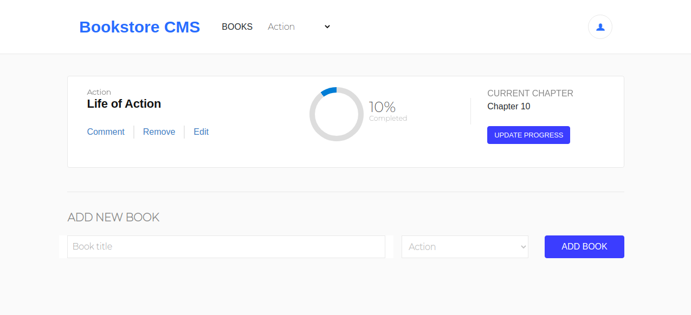

 

# React Bookstore

In this project I:

- Used React-Redux to build a bookstore app.

# What it does

- This is a Bookstore App, where you can add, remove, edit and follow the reading progress of your books.

## Built with

- React
- Redux
- Jest
- Enzyme
- HTML
- SCSS

## Live Demo

[Click here](https://murilo-react-bookstore.herokuapp.com/)

## Getting Started

- Clone the project to your local machine;
- `cd` into the project directory;
- Run `npm install` to install the necessary modules;
- Run `npm start`, the page will automatically load on [localhost:3000](localhost:3000);
- Run `npm test` to run the tests.

## Author

Murilo Roque Paiva da Silva

Github: [@MuriloRoque](https://github.com/MuriloRoque)

Twitter: [@MuriloRoquePai1](https://twitter.com/MuriloRoquePai1)

Linkedin: [MuriloRoque](https://www.linkedin.com/in/murilo-roque-b1268741/)

## 🤝 Contributing

Contributions, issues and feature requests are welcome! Start by:

- Forking the project
- Cloning the project to your local machine
- `cd` into the project directory
- Run `git checkout -b your-branch-name`
- Make your contributions
- Push your branch up to your forked repository
- Open a Pull Request with a detailed description to the development branch of the original project for a review

## Show your support

Give a ⭐️ if you like this project!
